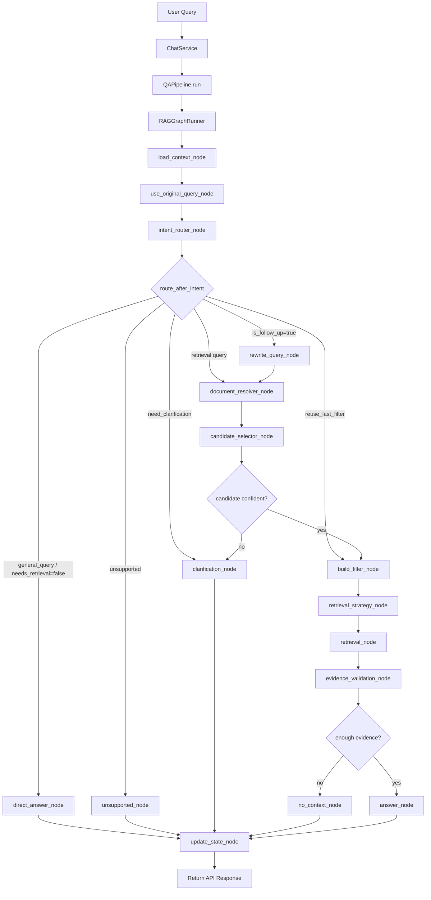

# RAG Pipeline

## Current Runtime Flow



## Key Design

- `intent_router_node` is now the single runtime router for intent and source scope.
- `scope_analyzer_node` is not used in the graph runtime path.
- `rewrite_detector_node` is not used in the graph runtime path.
- Query rewrite runs only after intent routing, and only when `intent_resolution.is_follow_up=true`.
- LLM routing never creates metadata filters. `build_filter_node` remains the only place that builds retrieval filters.

## Intent Router Output

The intent router returns both user intent and source scope:

```json
{
  "intent": "ask_question",
  "answer_style": "short_answer",
  "needs_retrieval": true,
  "is_follow_up": false,
  "action": "resolve_document",
  "scope": "current_uploads_only",
  "targets": [
    {
      "source_type": "user_upload",
      "session_scope": "current_session",
      "procedure_title_hint": null,
      "document_name_hint": null,
      "time_hint": null
    }
  ],
  "confidence": 0.92,
  "matched_rules": []
}
```

Valid retrieval scopes:

- `system_only`: administrative/system documents.
- `current_uploads_only`: files uploaded in the current session.
- `past_uploads_only`: older uploads with a time hint such as yesterday, last week, last month, or a date.
- `user_uploads_all`: user uploads in general.
- `mixed`: compare or cross-check system docs with user-uploaded documents.
- `none`: general query that does not need retrieval.
- `need_clarification`: source or requested document is genuinely ambiguous.

## Runtime State Compatibility

Downstream nodes still consume `scope_resolution`. It is now created directly from `intent_resolution`:

```json
{
  "action": "resolve_document",
  "scope": "current_uploads_only",
  "targets": [
    {
      "source_type": "user_upload",
      "session_scope": "current_session",
      "procedure_title_hint": null,
      "document_name_hint": null,
      "time_hint": null
    }
  ],
  "confidence": 0.92
}
```

`scope_resolution` is a compatibility state object. It is not produced by `scope_analyzer` in the runtime graph.

## Node Responsibilities

### `load_context_node`

Loads lightweight runtime context:

- `current_user_id`
- `current_session_id`
- `active_document_ids`
- `current_session_docs`
- `recent_chat_history`
- `last_resolved_context`

### `use_original_query_node`

Initializes query fields before routing:

- `final_query = original_query`
- `was_rewritten = false`
- `query_rewrite` is a pass-through record

### `intent_router_node`

Classifies:

- user intent
- retrieval need
- follow-up state
- source scope
- upload timing
- retrieval action
- retrieval targets

It writes:

- `intent_resolution`
- `scope_resolution`
- `retrieval_plan.action`
- `retrieval_plan.target_scope`
- `retrieval_plan.scope_resolution`

### `rewrite_query_node`

Runs only when `intent_resolution.is_follow_up=true`.

It rewrites the original query into a standalone retrieval query using recent chat history. It does not change source scope.

### `document_resolver_node`

Resolves concrete documents/procedures from metadata/catalog data.

It does not retrieve chunks and does not build the final metadata filter.

### `candidate_selector_node`

Handles multiple document candidates.

- 0 or 1 candidate: continue.
- Multiple upload documents for time/session scope: continue across candidates.
- Multiple ambiguous system candidates: ask for clarification.

### `build_filter_node`

Builds the final deterministic metadata filter.

If `scope_resolution.action == "reuse_last_filter"`, it reuses `last_resolved_context.filter`.

### `retrieval_strategy_node`

Builds retrieval branches:

- `default`
- `summarize`
- `find_information`
- `hybrid_compare`

### `retrieval_node`

Runs vector retrieval with the final metadata filter.

### `evidence_validation_node`

Validates retrieved contexts before answer generation.

### `answer_node`

Generates an answer only from validated contexts.

### `direct_answer_node`

Handles greetings or chatbot capability questions without retrieval.

### `clarification_node`

Asks the user to clarify document/source when routing or candidate selection is ambiguous.

### `update_state_node`

Final graph node. Persistent conversation-state update is handled by `ChatService` and `ConversationStateManager`.

## Security Rules

- LLM output must not contain metadata filters.
- User-upload retrieval must always be constrained by `owner_user_id`.
- Current-session upload retrieval must include `owner_user_id` and current `session_id` when available.
- System document retrieval must constrain to system/global documents.
- Hybrid retrieval must keep system and user-upload branches separate.
- Final retrieval filters are built only in code.

## API Output

`QAPipeline.run()` keeps the same public response shape:

```json
{
  "answer": "...",
  "sources": [],
  "raw_contexts": [],
  "scope": "...",
  "intent_resolution": {},
  "scope_resolution": {},
  "document_resolution": {},
  "rewrite_gate": {},
  "query_rewrite": {},
  "retrieval_plan": {},
  "context_validation": {},
  "retrieval_filter": {}
}
```
